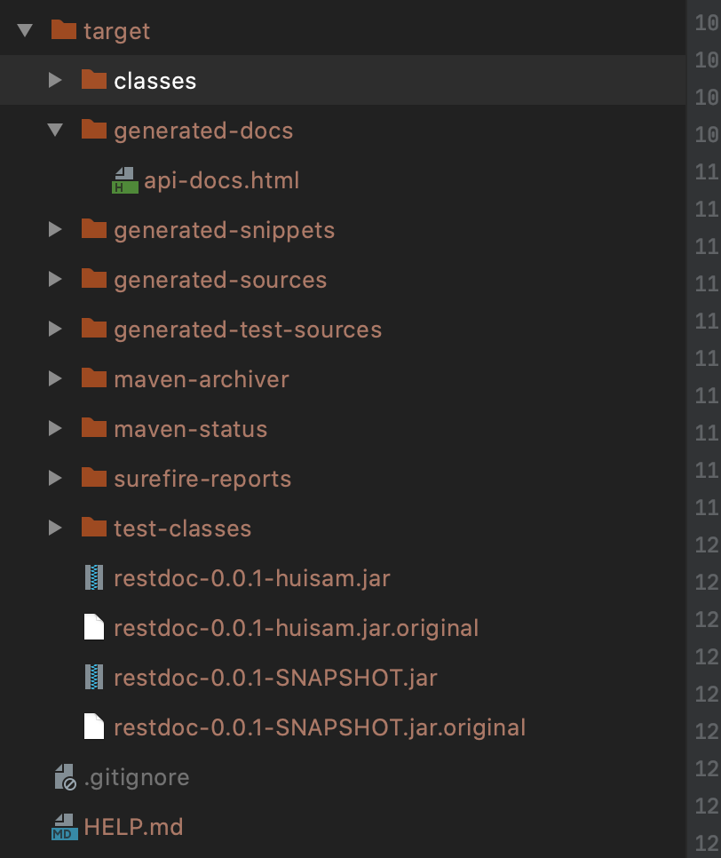
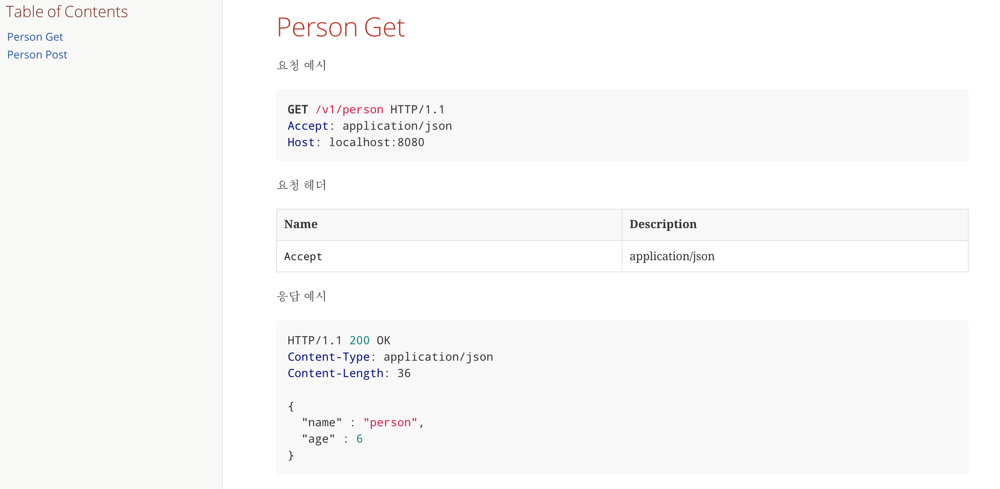

# Spring Rest Docs 

Spring 에서 지원하는 Documentation. 

 `Spring REST Docs` 는 테스트 코드를 기반으로 한 **RESTful** 문서 생성을 돕는 도구! 

### Why API 문서 자동화? 

보통 개발을 진행하기에 앞서서.  

Client와 여러 회의(?)를 통해서 `Spec` 문서를 작성! :pencil2: 하고,   

개발에 착수! :clock1: 하는 것이 일반적. 

그래서 Wiki에 `Spec` :page_facing_up:을 공개하고, 공개된 Spec을 바탕으로 API 개발에 착수. 

하지만... 

<div>
   
</div> 

보통은 잘 까먹고, Spec과 Code가 `동기화`가 잘 안되는 것이 일반적이다.  

**어떻게 하면 API Spec과 코드를 같이 가져갈 수 있을까?**  

*나는 문서 작성하기 매우매우 귀찮은데*  **코드로 해결할 수 있는 방안이 없을까?**.  

바로 그것이.  

1.  Swagger

2. Rest Docs 였다.. 

### Rest Docs vs Swagger 

보통 Spring 진영에서 API 문서 자동화를 뽑자면 크게 2가지로 나뉘는데.. 

1. Swagger
2. Rest Docs

하지만 Swagger는 ` Production Code`가 오염되는 치명적인 단점이 존재합니다 :fearful:

```java
 @ApiOperation(value = "View a list of available products", response = Iterable.class)
 @ApiResponses(value = {
     @ApiResponse(code = 200, message = "Successfully retrieved list"),
     @ApiResponse(code = 401, message = "You are not authorized to view the resource"),
     @ApiResponse(code = 403, message = "Accessing the resource you were trying to reach is forbidden"),
     @ApiResponse(code = 404, message = "The resource you were trying to reach is not found")
 }
 )
 @RequestMapping(value = "/list", method= RequestMethod.GET, produces = "application/json")
 public Iterable list(Model model){
   Iterable productList = productService.listAllProducts();
   return productList;
 }
```

~~벌써부터 보기가 조금 그렇네요~~ 

나는 Production Code를 보고 있는데, **코드를 읽는 건지 문서를 읽는 건지 잘 모르겠다**. 

 ~~아, 그래서 Swagger는 미리 API Spec을 작성하는 용도로만 썼구나 이해가 되더라~~ 

### REST Docs 소개 

```text
 Writing high-quality documentation is difficult. One way to ease that difficulty is to use tools that are well-suited to the job.
 To this end, Spring REST Docs uses Asciidoctor by default.
 Asciidoctor processes plain text and produces HTML, styled and laid out to suit your needs.
 If you prefer, you can also configure Spring REST Docs to use Markdown. - Spring Rest Docs 공식 문서
```

아 영어 너무 어렵다. 

대충 번역하자

 ```text
 고품질 문서 작성은 어렵습니다.
 이러한 어려움을 완화하는 한 가지 방법은 작업에 적합한 도구를 사용하는 것입니다.
 이를 위해 Spring REST Docs는 기본적으로 Asciidoctor를 사용합니다.
 Asciidoctor는 일반 텍스트를 처리하고 필요에 맞게 스타일이 지정된 HTML을 생성합니다.
 원하는 경우 Markdown을 사용하도록 Spring REST Docs를 구성 할 수도 있습니다.
 ```

---

그러니까 REST Docs는` Asciidoctor`를 기반으로 문서를 생성해주는구나 

그럼 `Asciidoctor`는 뭔데?

 ```
 markdown이 텍스트 기반 이메일 메시지를 작성하던 규약에서 발전 된 것이라
 상대적으로 단순한 표현력만 가지고 있는것에 비해
 asciidoc 는 SGML, Dockbook처럼 전문적인 문서를 작성할수 있는 매우 강력한 표현력을 제공합니다. 
 - [Asciidoctor.org](http://asciidoctor.org/)
 ```

* [Asciidoctor 문법 참고](https://narusas.github.io/2018/03/21/Asciidoc-basic.html)

:white_check_mark: 그래서, Spring에서는 위처럼 Asciidoctor 기반의 문서를 작성해주는 자동화된 환경을 제공해요!  

:white_check_mark: Spring Test Framework 기반에서 동작하는 문서 자동화된 Tool. 

:white_check_mark: 그래서, Unit Test에서 API 문서를 작성할 수 있다!  

 :100: **Unit Test를 강제화하고, 문서화를 강제화할 수 있다**. 

 ### 구현

:blue_book: **dependency** 가져오는 방법 

```groovy
plugins {
    id 'org.springframework.boot' version '2.3.1.RELEASE'
    id 'io.spring.dependency-management' version '1.0.9.RELEASE'
    id 'org.asciidoctor.convert' version '1.5.8' // asciidoctor plugin
    id 'java'
}
 
group = 'com.huisam'
version = '0.0.1-SNAPSHOT'
sourceCompatibility = '14'
 
configurations {
    compileOnly {
        extendsFrom annotationProcessor
    }
}
 
repositories {
    mavenCentral()
}
 
ext {
    set('snippetsDir', file("build/generated-snippets")) // 문서 저장위치
}
 
dependencies {
    implementation 'org.springframework.boot:spring-boot-starter-web'
    implementation 'org.springframework.boot:spring-boot-starter-webflux'
    implementation 'org.springframework.boot:spring-boot-starter-validation'
 
    compileOnly 'org.projectlombok:lombok'
    annotationProcessor 'org.projectlombok:lombok'
 
    testImplementation('org.springframework.boot:spring-boot-starter-test') {
        exclude group: 'org.junit.vintage', module: 'junit-vintage-engine'
    }
    testImplementation 'io.projectreactor:reactor-test'
    testCompile 'org.springframework.restdocs:spring-restdocs-mockmvc' // mock용
    testCompile 'org.springframework.restdocs:spring-restdocs-webtestclient' // webtestclient용 
}
 
test {
    outputs.dir snippetsDir // 선언한 디렉토리에 생성
    useJUnitPlatform()
}
 
asciidoctor {
    attributes 'snippets': snippetsDir // adoc 파일 생성시 올바르게 include하기 위함
    inputs.dir snippetsDir 
    dependsOn test
}
 
bootJar {
    dependsOn asciidoctor
    from ("${asciidoctor.outputDir}/html5") { // gradle은 src/docs/asciidoc 에 메인 adoc생성!
        into 'static/docs' // asciidoctor로 만든 문서는 static/docs 디렉토리로.!
    }
}
 
task copyDocument(type: Copy) { // 생성된 docs 파일을 build시 static 아래에 docs로 복사!
    dependsOn bootJar
 
    from file("build/asciidoc/html5/")
    into file("src/main/resources/static/docs")
}
 
build {
    dependsOn copyDocument // build시 copy 실행
}
```

그 다음 이쁘게 꾸미기 위한 Configuration! :blush:   

```java
package com.huisam.documentation;
 
import org.springframework.boot.test.autoconfigure.restdocs.RestDocsMockMvcConfigurationCustomizer;
import org.springframework.boot.test.autoconfigure.restdocs.RestDocsWebTestClientConfigurationCustomizer;
import org.springframework.boot.test.context.TestConfiguration;
import org.springframework.context.annotation.Bean;
 
import static org.springframework.restdocs.operation.preprocess.Preprocessors.prettyPrint;
 
@TestConfiguration
public class RestDocConfiguration {
 
    @Bean
    public RestDocsMockMvcConfigurationCustomizer restDocsMockMvcConfigurationCustomizer() {
        return configurer -> configurer.operationPreprocessors()
                .withRequestDefaults(prettyPrint())
                .withResponseDefaults(prettyPrint());
    }
 
    @Bean
    public RestDocsWebTestClientConfigurationCustomizer restDocsWebTestClientConfigurationCustomizer() {
        return configurer -> configurer.operationPreprocessors()
                .withRequestDefaults(prettyPrint())
                .withResponseDefaults(prettyPrint());
    }
}
```

실제 구현하는 방식은 :two:가지 방법을 소개해드릴게요. 

 :heavy_check_mark: **MockMvc Test**. 

```java
package com.huisam.documentation;
 
import com.fasterxml.jackson.databind.ObjectMapper;
import org.junit.jupiter.api.DisplayName;
import org.junit.jupiter.api.Test;
import org.springframework.beans.factory.annotation.Autowired;
import org.springframework.boot.test.autoconfigure.restdocs.AutoConfigureRestDocs;
import org.springframework.boot.test.autoconfigure.web.servlet.WebMvcTest;
import org.springframework.context.annotation.Import;
import org.springframework.http.HttpHeaders;
import org.springframework.http.MediaType;
import org.springframework.restdocs.payload.JsonFieldType;
import org.springframework.test.web.servlet.MockMvc;
 
import static org.hamcrest.Matchers.containsString;
import static org.springframework.restdocs.headers.HeaderDocumentation.*;
import static org.springframework.restdocs.mockmvc.MockMvcRestDocumentation.document;
import static org.springframework.restdocs.payload.PayloadDocumentation.*;
import static org.springframework.restdocs.snippet.Attributes.key;
import static org.springframework.test.web.servlet.request.MockMvcRequestBuilders.get;
import static org.springframework.test.web.servlet.request.MockMvcRequestBuilders.post;
import static org.springframework.test.web.servlet.result.MockMvcResultHandlers.print;
import static org.springframework.test.web.servlet.result.MockMvcResultMatchers.jsonPath;
 
@WebMvcTest(PersonController.class)
@Import(RestDocConfiguration.class) // 테스트 설정 import
@AutoConfigureRestDocs // 알아서 설정해준다~!
class PersonControllerTest {
 
    @Autowired
    private MockMvc mockMvc;
 
    @Autowired
    private ObjectMapper objectMapper;
 
    @Test
    @DisplayName("Person Get Test")
    void Person_Get_Test() throws Exception {
        /* given when then */
        this.mockMvc.perform(get("/v1/person").accept(MediaType.APPLICATION_JSON))
                .andDo(print())
                .andDo(document("person-get",
                        requestHeaders( // 요청 헤더
                                headerWithName(HttpHeaders.ACCEPT).description(MediaType.APPLICATION_JSON_VALUE)
                        ),
                        responseHeaders( // 응답 헤더
                                headerWithName(HttpHeaders.CONTENT_TYPE).description(MediaType.APPLICATION_JSON_VALUE)
                        ),
                        responseFields( // 응답 필드
                                fieldWithPath("name").description("Name of Person"),
                                fieldWithPath("age").description("Age of Person")
                        ))
                )
                .andExpect(jsonPath("$.name").value(containsString("person")))
                .andExpect(jsonPath("$.age").isNumber())
        ;
    }
 
    @Test
    @DisplayName("Person Post Test")
    void person_post_test() throws Exception {
        /* given */
        ClientRequest clientRequest = new ClientRequest("hi");
 
        /* when & then */
        this.mockMvc.perform(post("/v1/person")
                .contentType(MediaType.APPLICATION_JSON)
                .accept(MediaType.APPLICATION_JSON)
                .content(objectMapper.writeValueAsString(clientRequest))
        )
                .andDo(print())
                .andDo(document("person-post",
                        requestHeaders(
                                headerWithName(HttpHeaders.CONTENT_TYPE).description(MediaType.APPLICATION_JSON_VALUE),
                                headerWithName(HttpHeaders.ACCEPT).description(MediaType.APPLICATION_JSON_VALUE)
                        ),
                        requestFields(
                                fieldWithPath("name").optional().description("Name of Person")
                        ),
                        responseHeaders(
                                headerWithName(HttpHeaders.CONTENT_TYPE).description(MediaType.APPLICATION_JSON_VALUE)
                        ),
                        responseFields(
                                fieldWithPath("name").type(JsonFieldType.STRING).description("Name of Person")
                                        .attributes(key("constraint").value("3자 이내")),
                                fieldWithPath("age").type(JsonFieldType.NUMBER).description("Age of Person").optional()
                        ))
                )
                .andExpect(jsonPath("$.name").value(containsString("hi")))
                .andExpect(jsonPath("$.age").isNumber())
        ;
    }
}
```

 :heavy_check_mark: **WebTestClient**. 

```java
package com.huisam.restdoc;
 
import org.junit.jupiter.api.DisplayName;
import org.junit.jupiter.api.Test;
import org.springframework.beans.factory.annotation.Autowired;
import org.springframework.boot.test.autoconfigure.restdocs.AutoConfigureRestDocs;
import org.springframework.boot.test.autoconfigure.web.reactive.WebFluxTest;
import org.springframework.context.annotation.Import;
import org.springframework.http.HttpHeaders;
import org.springframework.http.MediaType;
import org.springframework.restdocs.payload.JsonFieldType;
import org.springframework.test.web.reactive.server.WebTestClient;
import org.springframework.web.reactive.function.BodyInserters;
 
import static org.assertj.core.api.Assertions.assertThat;
import static org.springframework.restdocs.headers.HeaderDocumentation.*;
import static org.springframework.restdocs.payload.PayloadDocumentation.*;
import static org.springframework.restdocs.webtestclient.WebTestClientRestDocumentation.document;
 
@WebFluxTest(PersonController.class)
@Import(RestDocConfiguration.class)
@AutoConfigureRestDocs
public class WebClientPersonControllerTest {
 
    @Autowired
    private WebTestClient webTestClient;
 
    @Test
    @DisplayName("Person Post Test")
    void test() {
        /* given */
        ClientRequest clientRequest = new ClientRequest("hi");
 
        /* when */
        final Person responsePerson = webTestClient.post()
                .uri("/v1/person")
                .contentType(MediaType.APPLICATION_JSON)
                .accept(MediaType.APPLICATION_JSON)
                .body(BodyInserters.fromValue(clientRequest))
                .exchange()
                .expectStatus().isOk()
                .expectBody(Person.class)
                .consumeWith(
                        document("web-test-person-post", // 디렉토리명(generated-snippets/web-test-person-post)
                                requestHeaders( // RequestHeader 작성
                                        headerWithName(HttpHeaders.CONTENT_TYPE).description(MediaType.APPLICATION_JSON_VALUE),
                                        headerWithName(HttpHeaders.ACCEPT).description(MediaType.APPLICATION_JSON_VALUE)
                                ),
                                requestFields( // RequestField 작성
                                        fieldWithPath("name").optional().description("Name of Person")
                                ),
                                responseHeaders( // RequestHeader 작성
                                        headerWithName(HttpHeaders.CONTENT_TYPE).description(MediaType.APPLICATION_JSON_VALUE)
                                ),
                                responseFields( // ResponseField 작성
                                        fieldWithPath("name").type(JsonFieldType.STRING).description("Name of Person"),
                                        fieldWithPath("age").type(JsonFieldType.NUMBER).description("Age of Person")
                                ))
                )
                .returnResult()
                .getResponseBody();
 
        /* then */
        assertThat(responsePerson)
                .extracting("name")
                .isEqualTo(clientRequest.getName());
    }
} 
```

요렇게 만들어주시고~. 

소스파일을 빌드해서 테스트를 성공적으로 돌리게 되면. 

아래와 같이 html 파일이 만들어지는데요.!  

<div>
  
</div>

우리가 처음에 

`static file`로 해당 `html`을 복사하는 기능을 추가했기 때문에. 

실제 **view**로 랜더링할 수 있게 됩니다!!  

<div>
  
</div>


### 단점은 존재

* 테스트가 실행될 때마다, snippets를 항상 생성한다
*  asciidoc이 어렵다 항상 난이도가 높은 학습이면은 좋은 경우가 대게 많더라구요..! :smile:  ​ 

### 참고 

* [Spring Rest Docs](https://docs.spring.io/spring-restdocs/docs/current/reference/html5/)
*  [Asciidoctor 문법 참고](https://narusas.github.io/2018/03/21/Asciidoc-basic.html)

